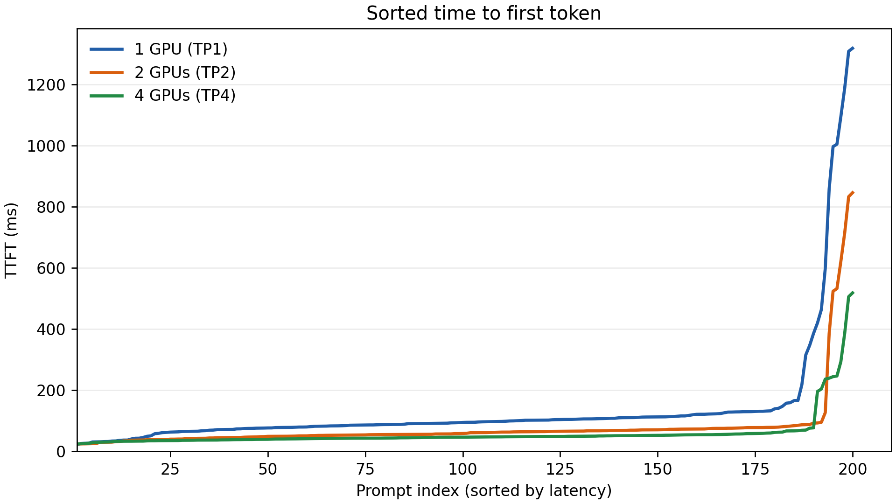
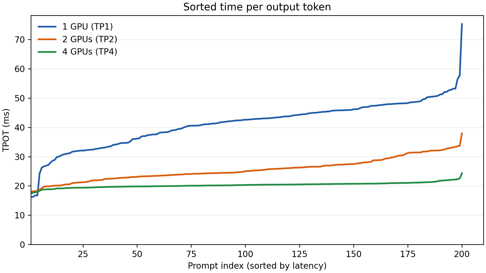
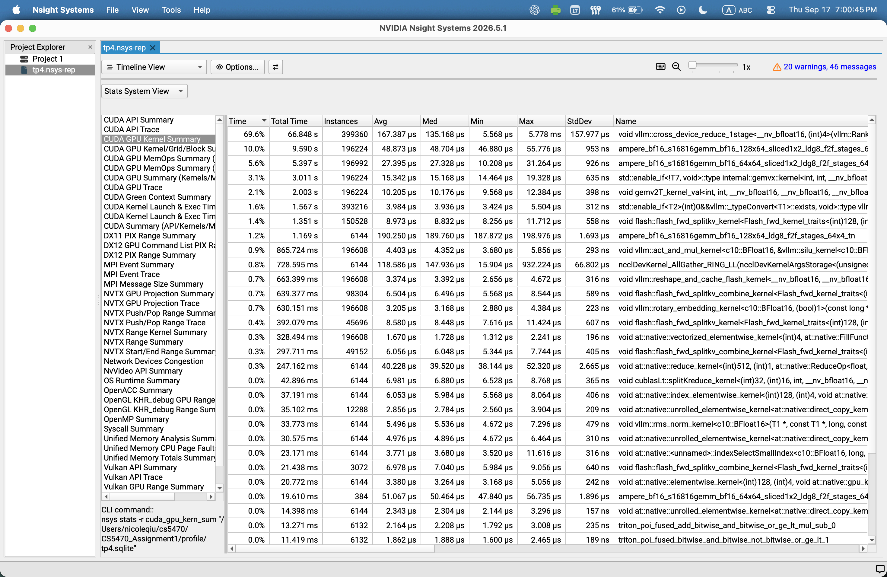

# CS5470 Assignment 1 Report

## Task 1: Single-GPU Benchmark

| Metric | p50 | p99 |
| --- | ---: | ---: |
| Time to first token (TTFT) | 94.98 ms | 1190.52 ms |
| Time per output token (TPOT) | 42.60 ms | 56.50 ms |

The single-GPU benchmark shows relatively good typical latency but a large tail-latency spike for the first token. Median TTFT is only 94.98 ms, while p99 increases to 1190.52 ms, meaning a small fraction of requests wait significantly longer before the first token is returned. In comparison, TPOT is much more stable, increasing only from 42.60 ms at p50 to 56.50 ms at p99. This means that most of the latency differences occur before the first token is generated. This is likely due to differences in prompt processing or request scheduling, but once a request is processed the token generation itself remains relatively consistent. 

## Task 2: Multi-GPU Benchmark

| GPUs | TTFT p50 (ms) | TTFT p99 (ms) | TPOT p50 (ms) | TPOT p99 (ms) | Output tokens/s |
| ---: | ---: | ---: | ---: | ---: | ---: |
| 1 | 94.98 | 1190.52 | 42.60 | 56.50 | 1609.82 |
| 2 | 59.09 | 717.15 | 25.06 | 33.55 | 1868.15 |
| 4 | 46.73 | 388.95 | 20.33 | 22.29 | 1939.08 |

TTFT p99(TP2)/p99(TP1) = **0.602**
TTFT p99(TP4)/p99(TP1) = **0.327**
TPOT p50(TP4)/p50(TP1) = **0.477**

Adding more GPUs improved latency and throughput. Compared with 1 GPU, 2 GPUs reduced the worst case TTFT to 60.2% of the original value, while 4 GPUs reduced it to 32.7%. For 4 GPUs, median TPOT was also only 47.7% of the single-GPU value. Throughput increased from 1609.82 tokens/s with 1 GPU to 1939.08 tokens/s with 4 GPUs. However, the throughput gains become smaller as more GPUs are added. This suggests that tensor parallelism improves latency significantly, but less so for throughput. This is likely due to communication overhead between GPUs. 

## Task 3: Performance Visualization

Both plots show that increasing the number of GPUs reduces latency. For TPOT, the curves are relatively smooth. TP4 stays near ~20 ms for most requests, while TP1 is mostly around 30–50 ms. This suggests multi-GPU execution speeds up token generation. For TTFT, the difference is much more noticeable at the tail end. They all show a sharp latency increase for the slowest requests, but that spike is a lot smaller when more GPUs are added. 

## Task 4: NVIDIA Nsight Profiling

| Kernel | Total time (ns) | Share of kernel time |
| --- | ---: | ---: |
| `vllm::cross_device_reduce_1stage<__nv_bfloat16, 4>` | 66,847,922,806 | 69.6% |
| `ampere_bf16_s16816gemm_bf16_128x64_sliced1x2_ldg8_f2f_stages_64x6_tn` | 9,590,177,620 | 10.0% |
| `ampere_bf16_s16816gemm_bf16_64x64_sliced1x2_ldg8_f2f_stages_64x6_tn` | 5,396,774,850 | 5.6% |

The first kernel is vLLM's AllReduce operation for communication among the four tensor-parallel ranks. It accounts for 69.6% of total recorded kernel time. 

## Task 5: Experiment

The weakest latency scaling was median TPOT from two to four GPUs: doubling the GPUs reduced TPOT only from 25.06 to 20.33 ms (18.9%), while p99 TTFT fell from 717.15 to 388.95 ms (45.8%). I tested H2, the hypothesis that the 2,048-token prefill batch limit split long prompts into too many chunks and added scheduling overhead. The probe used four GPUs and the same 200-request workload, changing only `--max-num-batched-tokens` from 2,048 to 4,096. Median TPOT rose slightly to 20.79 ms instead of falling, so the probe did not support H2 as the cause of weak TPOT scaling. The p99 TTFT did improve from 388.95 to 321.58 ms (17.3%), suggesting the larger batches may help slow first-token responses.

The most difficult part of this assignment was waiting for the vLLM server to start. Loading the model and initializing the server often took a long time, so I had to make sure my computer did not go to sleep or disconnect while I waited. This made running and rerunning experiments more time-consuming than expected, especially when I needed to change a parameter and restart the server.
